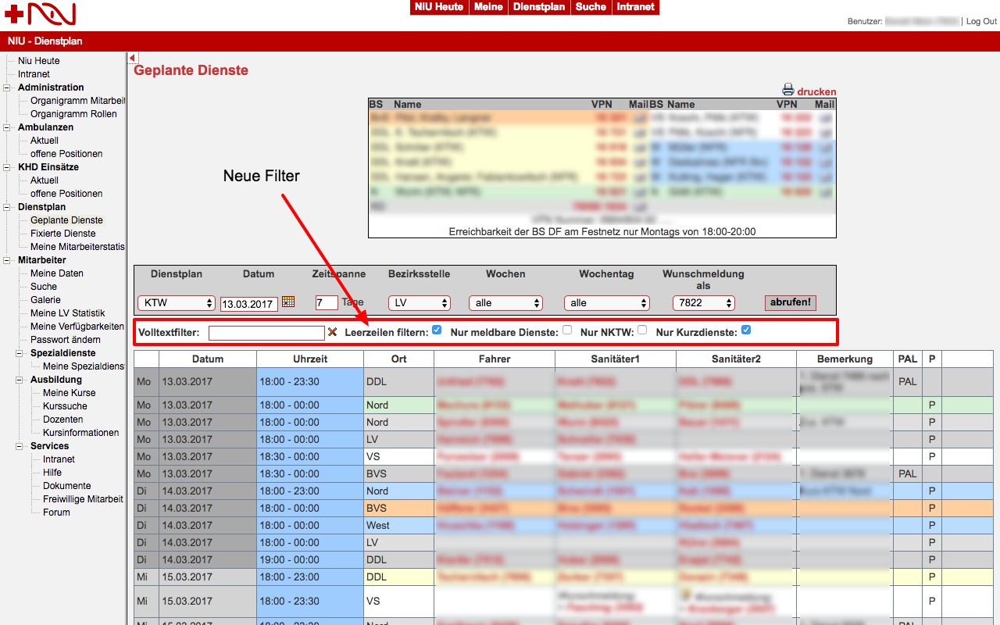
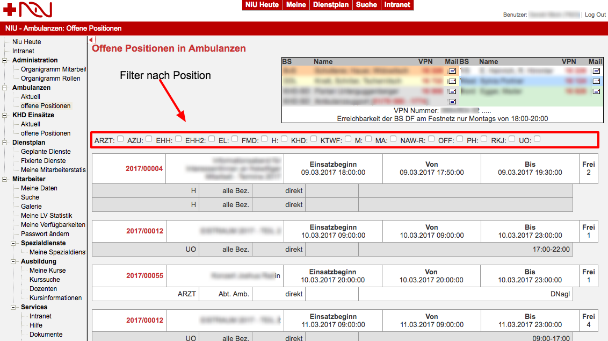
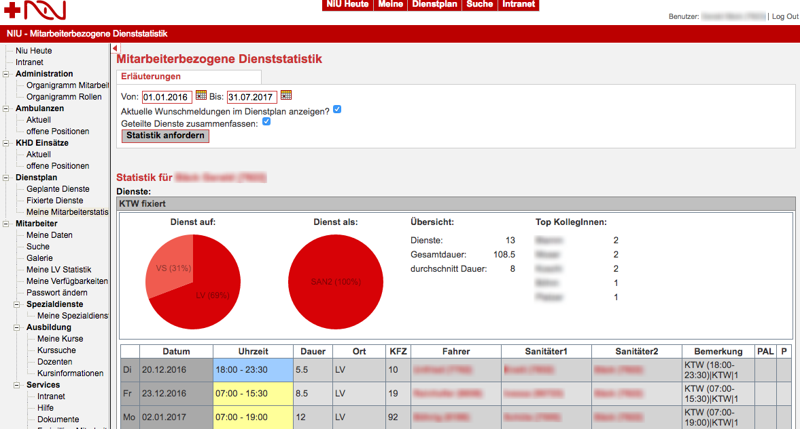
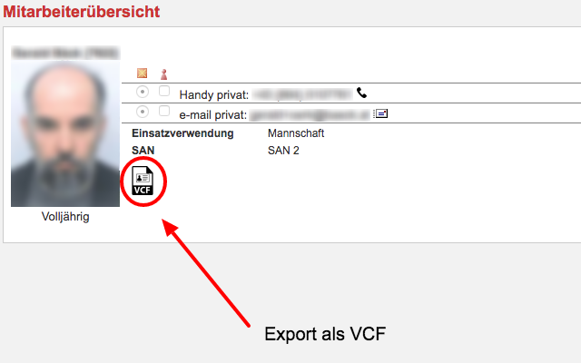

# NIU's little helper
Chrome Erweiterung zur einfacheren Bedienung des internen Verwaltungssystems des Wiener Roten Kreuz ([NIU](https://niu.wrk.at/)).

## Installation
Einfach über den [Google Store](https://chrome.google.com/webstore/detail/nius-litte-helper/fdldehahkijcfpmjhgnkggopliakcknj?hl=de) installieren.

## Funktionen
Derzeit werden folgende Funktionen unterstützt:

### Erweiterte Filter für den Dienstplan

### Erweiterte Filter für offene Positionen (Ambulanzen & KHD)

### Zusätzliche Daten zur Dienststatistik (Statistik, EmployeeDutyStatistic.aspx)

### Zusätzliche Daten zur LV-Statistik (LVStatistik, LVStatistic.aspx)
Eine zusätzliche Tabelle gruppiert die Anzahl der Dienste und Ausfahrten nach der
Dienstart (KTW, RTW) und der Position (Fahrer, SAN1, SAN2). Damit ist es leichter möglich die
benötigten Mindestausfahrten für Ausbildungen zu prüfen. Allerdings wird diese Statistik nur
quartalsweise abgeschlossen!

### Kurssuche

* Bei der Kurssuche wird für das Suchergebnis eine Volltextsuche in der Tabelle mit den gefundenen Kursen ermöglicht.
* Bei der Kurssuche werden jetzt automatisch alle Kurse des nächsten Jahres gesucht. Indem die Suche beim Besuch der Seite automatisch ausgeführt wird. (Dieses Verhalten kann über die Einstellungen des Addons deaktiviert werden)
* Es wird das Formular Kurssuche ausgeblendet
* Es wird das Formular Kursauswahl ausgeblendet
* Die Tabelle mit den angezeigten Kursen ist sortierbar
* Der Link um die Kursdetails zu öffnen ganz links öffnet einen neuen Kurs per standard in einem neuen BrowserFenster/BrowserTab

## Kurssuche TODO bzw. in Arbeit:

* Anmeldebutton für Benutzer, der ein EMail erzeugt per mailto in dem alle relevanten Daten für die Kursanmeldung bereits ausgefüllt sind. Wie zuständige Ausbildung, Kursnummer, Kursname, Dienstnummer, und Name.
* Vordefinierte Filter um nur bestimmte Kurse anzeigen zu lassen, geplant sind zumindest alle §50 Kurse, FK-Kurse, etc.

### Kursdetails

* Es wird die zuletzt verwendete Kostenstelle gespeichert
* Es wird automatisch ein Kürzel eingetragen, das über die Optionen des Browser Plugins gesetzt werden kann
* Das Drop-Down select Menü unterstützt jetzt eine Volltextsuche nach den Mitarbeiternamen bzw. der Dienstnummer

### Download von Kontaktdaten als VCF file

### Liste/Ausdruck
Die Funktion Mitarbeiter Liste/Ausdruck öffnet normal ein neues Fenster, in dem alle gefundenen Mitarbeiter angezeigt werden. Diese Liste wurde erweitert:

* Es gibt jetzt eine sortierbare Tabelle mit Volltextsuche
* Berechnung der Dienste und Stunden der letzten 6 Monate im Bereich RD (noch ohne Ambulanzen!)
* Abfrage der Grundausbildung, des Dienstgrades und des Gaststatus der Mitarbeiter

Diese Abfragen werden in einer DB lokal zwischengespeichert um nicht unnötige Requests an den Server zu erzeugen.

### Mitarbeiter / Neu
Die Funktion Mitarbeiter / Neu öffnet normalerweise ein Formular, wodurch sich neue Mitarbeiter anlegen lassen können. Dieses Formular wurde erweitert:

* Es lässt sich nun automatisch eine freie Dienstnummer dem neuen Mitarbeiter zuordnen.
* Es lässt sich nun eine Liste aller freien Dienstnummern anzeigen.

## Version History
+ *0.10* initial commit
+ *0.20* VCF Download
+ *0.21* Kurzdienstselector wird nur mehr angezeigt, wenn es Kurzdienste gibt
+ *0.22* Die Kontakttabelle der Dienstführung wird jetzt standardmäßig ausgeblendet
+ *0.30* [NIU+ Features](#zusätzliche-daten-zur-lv-statistik-lvstatistik-lvstatisticaspx) eingebaut
+ *0.31* Zusätzliche Filter für geplante Dienste, Seite aufgeräumt
+ *0.32* Überarbeitete [FunktionärInnenfeatures](https://github.com/geraldbaeck/NIUsLittleHelper/pull/2)
+ *0.33* FunktionärInnenfeatures: Funktion zur Anzeige von freien Dienstnummern, Ambulanzen in Dienststatistik erfasst
+ *0.34* FunktionärInnenfeatures: Gaststatus und Dienstgrad lassen sich nun in Liste/Ausdruck auswerten um Beförderungen zu erleichtern.
+ *0.35* Funktion zum herunterladen einer Kalenderdatei mit den RD-Diensten der nächsten 14 Tage.
+ *0.36* Kurssuche: Filter nach Ausbildungsart
+ *0.37* Pflichtfortbildungen über Liste/Ausdruck
+ *0.38* FunktionärInnenfeatures: SAN-Ampel in Liste/Ausdruck
+ *0.39* FunktionärInnenfeatures: Memos direkt in Liste/Ausdruck verfassen
+ *0.40* RTW Dienstpläne nun nach Permanenz filterbar + Benutzer wird nun über aktive Erweiterung informiert.
+ *0.41* Geplante Dienste können jetzt nach eigenen Diensten durchsucht/gefiltert werden

## Built With
* [Atom](https://github.com/atom/atom)
* [VSCode](https://github.com/Microsoft/vscode)
* [Javascript](https://en.wikipedia.org/wiki/JavaScript)
* [JQuery](https://jquery.com/)
* [Vex](https://github.com/hubspot/vex)
* jQueryUI
* PouchDB
* jQuery DataTable

## Contributing
Always welcome just fork and request. Join us on [Slack](https://niuslittlehelpers.slack.com/signup).

## [Authors](https://github.com/geraldbaeck/NIUsLittleHelper/graphs/contributors)
* **Gerald Bäck** - [github](https://github.com/geraldbaeck) - [blog](http://dev.baeck.at/)
* **Sebastian Kuttnig** - [github](https://github.com/dersebbel)
* **Stephan Spindler** - [github](https://github.com/spind42)
* **Daniel Steiner** - [github](https://github.com/danielsteiner) - [web](https://danielsteiner.net)

## License
This is free and unencumbered software released into the public domain - see the [UNLICENSE.md](UNLICENSE.md) file for details. NIU is probably intellectual property of the Austrian Red Cross.
